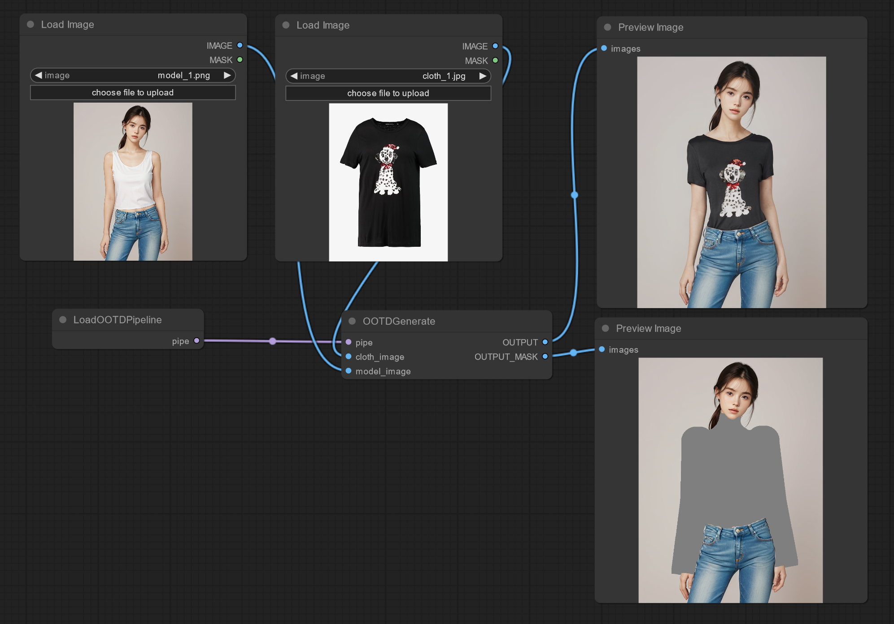
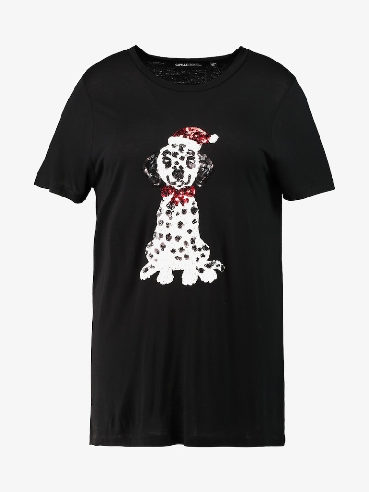

# ComfyUI OOTDiffusion

A ComfyUI custom node that simply integrates the OOTDiffusion functionality.

一个简单接入 OOTDiffusion 的 ComfyUI 节点。



## Instruction 指南

根据 https://git-lfs.com 安装 git lfs：

```txt
sudo apt install git-lfs
git lfs install
```

拉取 Huggingface 库至 `models/OOTDiffusion` 目录：

```txt
git clone https://huggingface.co/levihsu/OOTDiffusion models/OOTDiffusion
```

拉取 Huggingface 时大约会下载 8 个模型，假如断开连接，可以使用下面命令恢复下载：

```txt
cd models/OOTDiffusion
git lfs fetch
git checkout main
```

建立环境并下载依赖：

```txt
conda create -n ootd
conda activate ootd
conda install pytorch torchvision torchaudio pytorch-cuda=11.8 -c pytorch -c nvidia
conda install cudatoolkit-dev -c conda-forge
```

安装 custom_nodes/ComfyUI-OOTDiffusion 目录下的 requirements.txt。

启动 ComfyUI 即可。

## 节点

LoadOOTDPipeline: 加载 OOTD Pipeline

OOTDGenerate: 生成图像

## 示例图片



