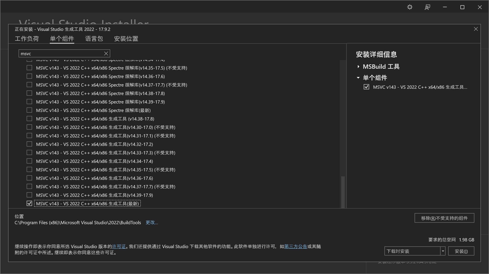
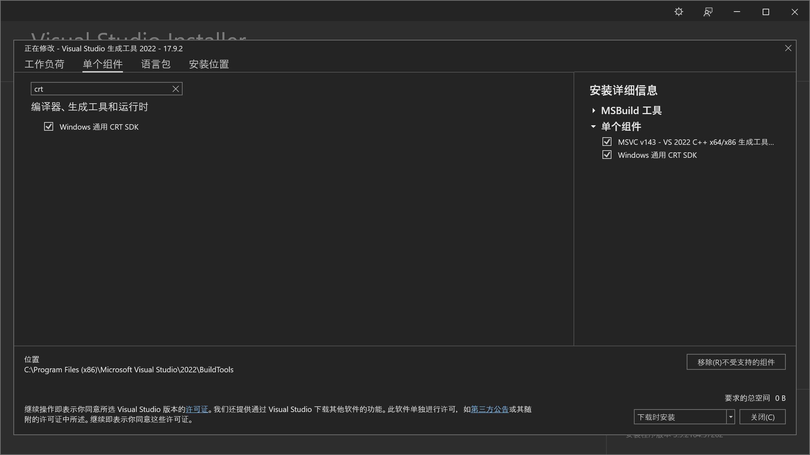
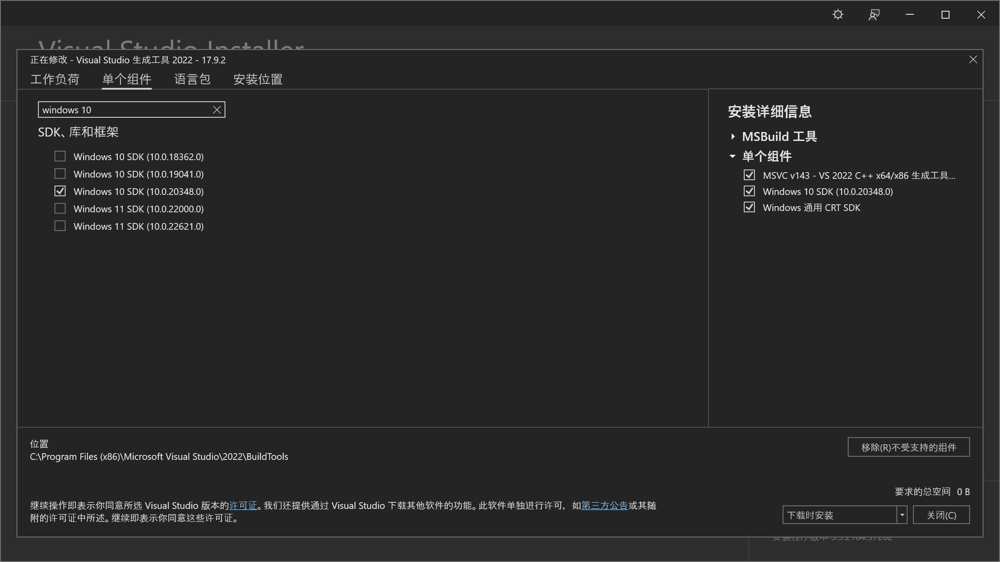

# ComfyUI OOTDiffusion

A ComfyUI custom node that simply integrates the [OOTDiffusion](https://github.com/levihsu/OOTDiffusion) functionality.

一个简单接入 OOTDiffusion 的 ComfyUI 节点。


Example workflow: [workflow.json](./assets/workflow.json)

## Instruction 指南

Create environment and download dependencies:

创建环境并下载依赖：

```txt
conda create -n ootd python=3.10
conda activate ootd

conda install pytorch torchvision torchaudio pytorch-cuda=12.1 -c pytorch -c nvidia

# Clone to custom_nodes
git clone https://github.com/AuroBit/ComfyUI-OOTDiffusion.git custom_nodes/ComfyUI-OOTDiffusion

# Install dependencies
pip install -r custom_nodes/ComfyUI-OOTDiffusion/requirements.txt
```

Simply start ComfyUI and drag the example [workflow.json](./assets/workflow.json).

启动 ComfyUI 并拖入示例 [workflow.json](./assets/workflow.json) 即可。

## Windows 指南

Windows 除了需要参照上面的配置教程，还需要额外配置 MSVC：

首先是 nvcc 安装（确保 VIRTUAL_ENV/bin/nvcc 存在）：

```
conda install cuda-nvcc -c conda-forge
```






根据自己系统选择 Windows 10 SDK / Windows 11 SDK.

**注意：不要从 Installer 点击启动 terminal**

进入 `C:\Program Files (x86)\Microsoft Visual Studio\2022\BuildTools\VC\Auxiliary\Build` 目录，
右击进入 terminal，注意要用 CMD 不要 powershell。

启动 native x64 target x64 的编译环境变量（兼容环境下 nvcc 编译会报错）：

```
vcvars64.bat
```


编译完成，成功启动。

## FAQ 常见错误

> OSError: CUDA_HOME environment variable is not set. Please set it to your CUDA install root.
>
> 参照：https://github.com/conda/conda/issues/7757

> subprocess.CalledProcessError: Command '['where', 'cl']' returned non-zero exit status 1.
>
> 解决办法：仅在 Windows 下出现，根据 [Windows 配置教程](#Windows-指南)

## Node 节点

Load OOTDiffusion Local: 从本地目录加载 OOTDiffusion Pipeline

Load OOTDiffusion from Hub: 从 huggingface 自动下载并加载 OOTDiffusion Pipeline

OOTDiffusion Generate: 生成图像

    cfg: 输出图像和输入衣服的贴合程度

## Example image 示例图片

[衣服 1](./assets/cloth_1.jpg)

[模特 1](./assets/model_1.png)

## Detail 细节

目前此项目只是对 OOTDiffusion 的功能做了个简单的迁移。
OOTDiffusion 本体依赖于 `diffusers==0.24.0` 实现，所以假如有其他节点的依赖冲突是没办法解决的（本就不该依赖 diffusers）。
靠 vendor 也能解决，所以也不是大问题。

在 `Ubuntu 22.02` / `Python 3.10.x` 下可以正常运行。Windows 没有测试过。

## 更新日志 Release Note

2024-03-01:

添加 Windows 安装教程

2024-02-25:

移除 git lfs 下载教程，提供 Load OOTDiffusion from Hub 节点
