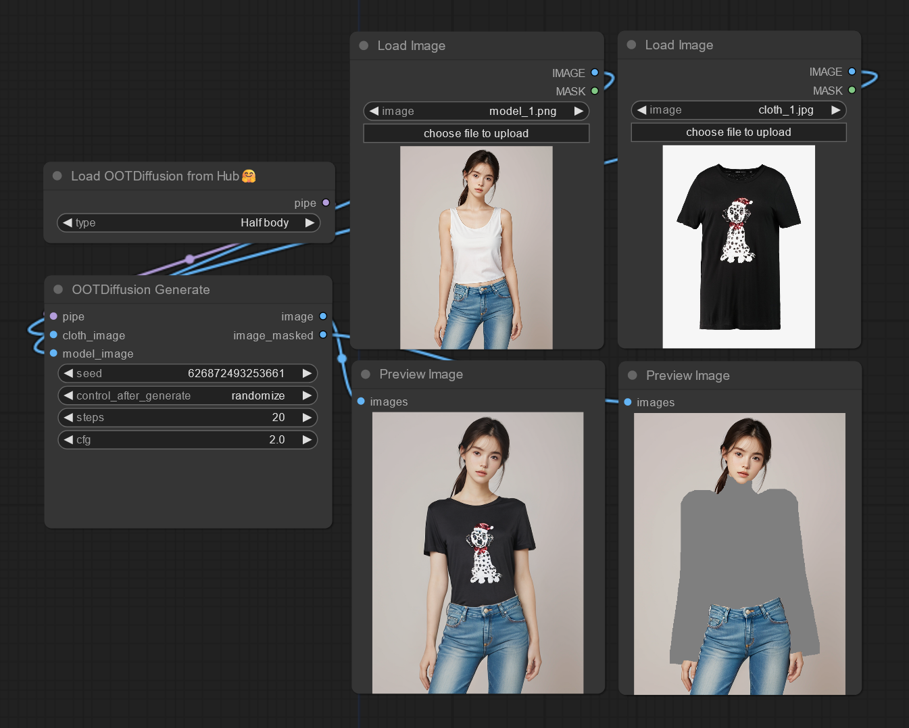

# ComfyUI OOTDiffusion

A ComfyUI custom node that simply integrates the [OOTDiffusion](https://github.com/levihsu/OOTDiffusion) functionality.

一个简单接入 OOTDiffusion 的 ComfyUI 节点。



Example workflow: [workflow.json](./assets/workflow.json)

## Instruction 指南

根据 https://git-lfs.com 安装 git lfs：

Ubuntu / Debian:

```txt
sudo apt install git-lfs
```

git lfs 初始化：

```txt
git lfs install
```

拉取 huggingface 🤗 库至 ComfyUI 根目录下的 `models/OOTDiffusion` 目录：

```txt
git clone https://huggingface.co/levihsu/OOTDiffusion models/OOTDiffusion
```

拉取 huggingface 时大约会下载 8 个模型，假如断开连接，可以使用下面命令恢复下载：

```txt
cd models/OOTDiffusion
git lfs fetch
git checkout main
```

创建环境并下载依赖：

```txt
conda create -n ootd
conda activate ootd

# 选择安装 11.8 / 12.1 cuda toolkit
conda install pytorch torchvision torchaudio pytorch-cuda=12.1 -c pytorch -c nvidia

# 安装此项目的依赖
pip install -r custom_nodes/ComfyUI-OOTDiffusion/requirements.txt
```

启动 ComfyUI 即可。

## FAQ 常见错误

> OSError: CUDA_HOME environment variable is not set. Please set it to your CUDA install root.
>
> 解决方法：`conda install -c conda-forge cudatoolkit-dev`。
> 参照：https://github.com/conda/conda/issues/7757

> subprocess.CalledProcessError: Command '['where', 'cl']' returned non-zero exit status 1.
>
> 解决办法：仅在 Windows 下出现，可能需要配置一下 MSVC 编译器。

## Node 节点

Load OOTDiffusion Local: 从本地目录加载 OOTDiffusion Pipeline

Load OOTDiffusion from Hub: 从 huggingface 自动下载并加载 OOTDiffusion Pipeline

OOTDiffusion Generate: 生成图像

    cfg: 输出图像和输入衣服的贴合程度

## Example image 示例图片

[衣服 1](./assets/cloth_1.jpg)

[模特 1](./assets/model_1.png)

## Detail 细节

目前此项目只是对 OOTDiffusion 的功能做了个简单的迁移。
OOTDiffusion 本体依赖于 `diffusers==0.24.0` 实现，所以假如有其他节点的依赖冲突是没办法解决的（本就不该依赖 diffusers）。
靠 vendor 也能解决，所以也不是大问题。

在 `Ubuntu 22.02` / `Python 3.10.x` 下可以正常运行。Windows 没有测试过。

## 更新日志 Release Note

2024-02-25:

移除 git lfs 下载教程，提供 Load OOTDiffusion from Hub 节点
